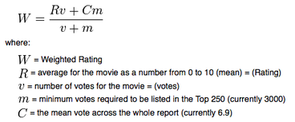

# IMDB-Movies-Recommendor-System

## Hi 😀

In this Repository I have made two recommendation models to recommend best movies on the IMDB.

 * First is the Content Based Recommendation System :- 

Content-based filtering uses item features to recommend other items similar to what the user likes, based on their previous actions or explicit feedback. In our case of IMDB movie dataset, The 'Overview' column is used in which the summary of each movie has given, from this I made a system which provides the similar movies on the context of the summary. 

* Second one is Weighted Average Recommendation System :- 

On the basis of the Weighted Average formula we will make a system which recommend the best suited movie for a customer.

In this file I have also made a recommender system on the basis of Popularity, The movie with maximum popularity will recommend first. 

After it I made a Recommender system with both parameters of Popularity and Weighted Average.

You can also find the dataset on - https://www.kaggle.com/tmdb/tmdb-movie-metadata

## Hope you will find this Useful.

